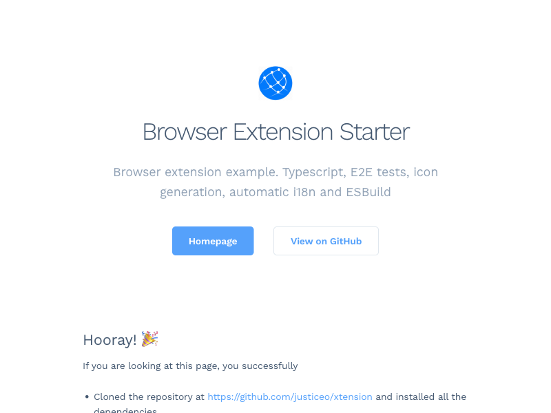

#  Browser Extension Starter

[](https://circleci.com/gh/essentialkit/xtension/?branch=main)

Browser extension starter kit with Typescript, E2E tests, icon generation, automatic i18n, Github pages automation and ESBuild



## Used by

- [Floating Scientific Calculator](https://chrome.google.com/webstore/detail/floating-scientific-calcu/mbfnbhfjnjeedaknilkfegfnnmmmmpmn) - 8K+ users, 5 ⭐ (84 ratings), 🏆 Featured extension.
- [Search & Link Previews](https://chrome.google.com/webstore/detail/search-link-preview/mmmfofondapflhgbdidadejnechhjocm) - 1K+ users, 5 ⭐ (55 ratings), 🏆 Featured extension.
- [Voice Search](https://chrome.google.com/webstore/detail/voice-search/agmgoemhckhccgibmoigonndjhjllcoh) - 11K+ users, 5 ⭐ (112 ratings)
- [Dictionary](https://chrome.google.com/webstore/detail/nhbchcfeodkcblfpdjdhelcfbefefmag) - 4K+ users, 5 ⭐ (22 ratings), 🏆 Featured extension.

## Project setup

```bash
# Install dependencies
npm install

# Build extension for development, watch for file changes and rebuild.
npm run build
npm run watch

# Generate compliant images assets for logo (default logo location src/assets/logo.png)
npm run generateIcons

# Translate app strings to all supported chrome locales
npm run translate

# Start an instance of Chromium with extension installed (using puppeteer)
# For Firefox, pass --browser=firefox as argument.
npm run start

# Build and package extension into a store-ready upload
node tools/esbuild.js build --prod

# Create extension package for Firefox/Opera/Edge by specifying --browser argument
node tools/esbuild.js build --prod  --browser=firefox

# Run tests
npm run test
```

<details><summary>E2E testing with Firefox.</summary>

By default, puppeteer only downloads Chromium, run the command below to install Firefox's equivalent of chromium:

```
PUPPETEER_PRODUCT=firefox npm i -D puppeteer --prefix ./node_modules/firefox-puppeteer
```

`PUPPETEER_PRODUCT=firefox` tells puppeteer to download firefox.

`--prefix ./node_modules/firefox-puppeteer` forces a new fetch of puppeteer. This is necessary since `node_modules/puppeteer` already exists (for chromium). The actual value of the prefix doesn't matter, just don't overwrite an actual package.

_NB:_ After running the above command, they will no be update to package.json or package-lock.json... since package "puppeteer" already exists.

</details>

## Install extension locally

#### Chrome

1. Open chrome and navigate to extensions page using this URL: chrome://extensions.
2. Enable the "Developer mode".
3. Click "Load unpacked extension" button, browse to `build/chrome-prod` or the `build/chrome-dev` directory and select it.

#### Firefox

1. Open firefox and navigate to `about:debugging#/runtime/this-firefox`.
2. Click the "Load Temporary Add-on" button.
3. Browse to the `build/firefox-prod` or the `build/firefox-dev` directory and select the `manifest.json` file.

## Features

- **Typescript to Js**: Write your entire chrome extension in Typescript and have it transpiled to JavaScript.
- **E2E extension test**: Start up a chrome browser with your extension installed, write your tests in Jasmine.
- **Generate extension icons**: Forget the pain of generating icons of different size to meet icons requirements.
- **Manifest V3 Compatible**: Easier submission to the Chrome Webstore.
- **Automatic translation**: The messages for all supported i18n locales are auto-generated from the English version.
- **Zero Dependencies**: This starter is minimal to avoid [supply-chain attacks](https://www.bleepingcomputer.com/news/security/npm-supply-chain-attack-impacts-hundreds-of-websites-and-apps/) which is rampant with Js projects.
- **Welcome and Uninstall pages**: To give your project a head start, welcome pages are great for demos and uninstall pages provide a thoughtful exit.
- **Utilities for common tasks**: Comes with helpers logging, storage, and requesting feedback.

### Notes

<details><summary>Keeping up with changes in this repo</summary>
Staying up-to-date with this repo after a fork:

1. Create a new repository by either forking/copying this one.

2. Add this repository as a remote to the new repo
   `git remote add xtension git@github.com:justiceo/xtension.git`

3. Fetch the latest updates from the xtension repo (template).
   `git fetch xtension`

4. Create a local branch to track xtension repo.
   `git checkout -B xtension && git branch -u xtension/master`

5. There should be two divergent histories now. `master -> origin/master` and `xtension -> xtension/master`.

6. Copy the changes from xtension to master without a commit.
   `git checkout xtension -- .`

7. Fix any changes then commit
`git commit -m "merged updates from xtension"`.
</details>

<details><summary>Integrating changes into this repo</summary>

1. Add xtension as a remote.
   `git remote add xtension git@github.com:justiceo/xtension.git`

2. Avoid pushing to it.
   `git remote set-url --push xtension do-not-push`

3. Create new branch to track xtension
   `git checkout -b base`

4. Pull changess from xtension and rebase onto it.
   `git pull xtension main --rebase -X theirs`

5. Push changes from base to origin
   `git push --set-upstream origin base`

6. Merge the changes from base into main
   `git merge base -X theirs --allow-unrelated-histories --no-commit --no-ff`

7. Review the diff and commit.
`git commit -m "up-to-date with xtension"`
</details>
